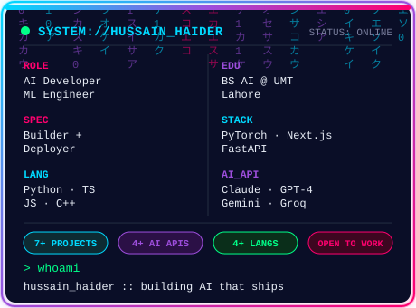
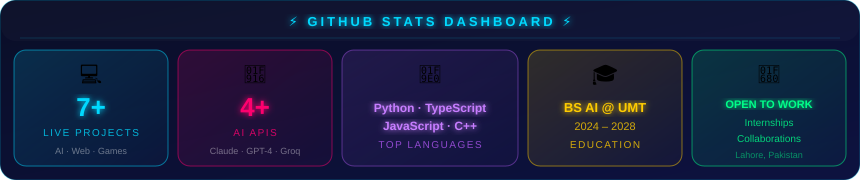
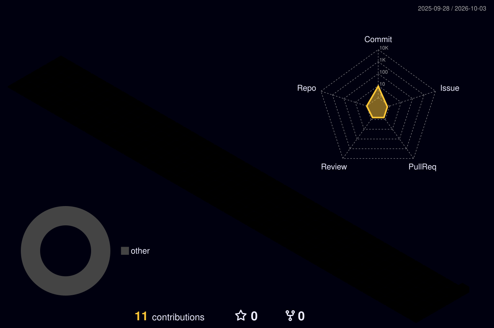
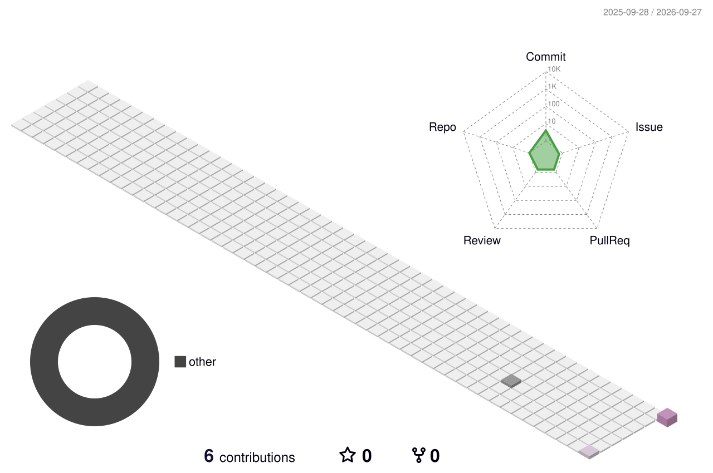
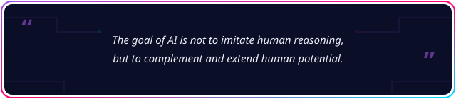

[](https://github.com/HussainHaider-005)



<div align="center">

[](https://www.linkedin.com/in/hussainhaider-012111301)
[](mailto:hussainhaider0204@gmail.com)


[](#-license--usage)

</div>


##  About Me

```python
class HussainHaider:
    role       = ["AI Developer", "ML Engineer", "Builder & Deployer"]
    education  = "BS Artificial Intelligence @ UMT Lahore (2024 - 2028)"
    location   = "Lahore, Punjab, Pakistan"
    languages  = ["Python", "TypeScript", "JavaScript", "C++"]
    frameworks = ["PyTorch", "Next.js", "FastAPI"]
    ai_apis    = ["Claude API", "GPT-4", "Gemini", "Groq"]
    deployed   = "7+ live projects"
    passion    = "Turning AI research into production-ready tools"
    status     = "Open to Internships & Collaborations"

    def hello(self):
        return "Let's build something amazing with AI!"
```


##  Currently Building

<div align="center">

[](#)
[](#)
[](#)

</div>


##  Featured Projects

<div align="center">

| # | Project | Highlight | Stack | Live |
|:--|:--------|:----------|:------|:-----|
| 1 | 🧠 **LogixAI** | RAG-based document intelligence · 500+ page PDFs · 5 languages | React, TypeScript, Supabase, Groq | [](https://logix-ai-document-intelligence.vercel.app/) |
| 2 | ☕ **Cafe Cloud** | Multi-page responsive coffee shop site | HTML5, CSS3 | [](https://cafecloud-seven.vercel.app/) |
| 3 | 👔 **House of Qalandar** | Premium unstitched menswear storefront · WhatsApp checkout | Next.js, React, Tailwind, TS | [](https://house-of-qalandar.netlify.app/) |
| 4 | 🤖 **Kryton AI** | AI excuse generator · 4 tones · Gemini API | HTML, JS, Gemini API | [](https://kryton-ai-excuse-generator.vercel.app/) |
| 5 | 🏃 **Neon Runner** | Synthwave endless runner · 3 difficulty modes | HTML5, JS, Canvas | [](https://neon-runner-grid-protocol.netlify.app/) |
| 6 | 🎲 **Ludo Strike** | Classic Ludo · 2-4 players · animated 3D dice | HTML5, CSS3, JS | [](https://ludo-strike-project.vercel.app/) |
| 7 | 🎬 **FlixNexus** | Movie discovery · smart recommendations · trailers | React, TypeScript, Vite | [](https://flix-nexus.vercel.app/) |
| 8 | 🍔 **Malang Smash** | Live cart · reviews · WhatsApp ordering | React, TypeScript, Supabase | [](https://malang-smash.vercel.app/) |

</div>


##  Certifications & Achievements

<div align="center">

| Certification / Achievement | Source |
|---|---|
| 🖥️ AWS, Cloud Computing & AI Applications Workshop | UMT Lahore |
| 🤖 Microsoft Copilot & Emerging Trends Workshop | UMT Lahore |
| 🚀 AI-Powered Learning Workshop — Exploring Future Technologies | UMT Lahore |
| 🎨 Freelancing & Graphic Designing Course | Jinnah College |
| 🎖️ ISSB Cadet — Leadership & Strategic Training | Defense Academy |

</div>


##  GitHub Stats

<div align="center">

&nbsp;&nbsp;&nbsp;&nbsp;

<br/><br/>


<br/>

<!-- Custom static dashboard: always renders, does not depend on the free github-readme-stats demo server -->


<br/>

[](#)
[](#)
[](#)
[](#)

<br/>


</div>


##  Contribution Snake


---

## 🌆 3D Contribution City






##  Dev Joke of the Day

<div align="center">


</div>


##  Quote of the Day

<div align="center">



</div>


##  License & Usage

<div align="center">

**All Rights Reserved © 2026 Hussain Haider**

</div>

This profile and every project listed above — including source code, ideas, designs, trained models, and documentation across all of Hussain Haider's repositories — is made publicly visible **for portfolio and demonstration purposes only**.

**No part of any linked repository may be copied, modified, distributed, sublicensed, or used** — in whole or in part, for personal, educational, or commercial purposes — without explicit prior written permission from the author.

Forking or cloning any of these repositories does **not** grant any rights to use, reproduce, or redistribute their contents.

If you are interested in using any part of this work, please contact directly for permission:

<div align="center">

🔗 **GitHub:** [github.com/HussainHaider-005](https://github.com/HussainHaider-005) &nbsp;&nbsp;|&nbsp;&nbsp; 📧 **Email:** hussainhaider0204@gmail.com

💼 **LinkedIn:** [linkedin.com/in/hussainhaider-012111301](https://www.linkedin.com/in/hussainhaider-012111301)

</div>


##  Connect

<div align="center">

[](mailto:hussainhaider0204@gmail.com)
[](https://www.linkedin.com/in/hussainhaider-012111301)
[](https://github.com/HussainHaider-005)

<br/>

[](https://github.com/HussainHaider-005)

</div>

---


